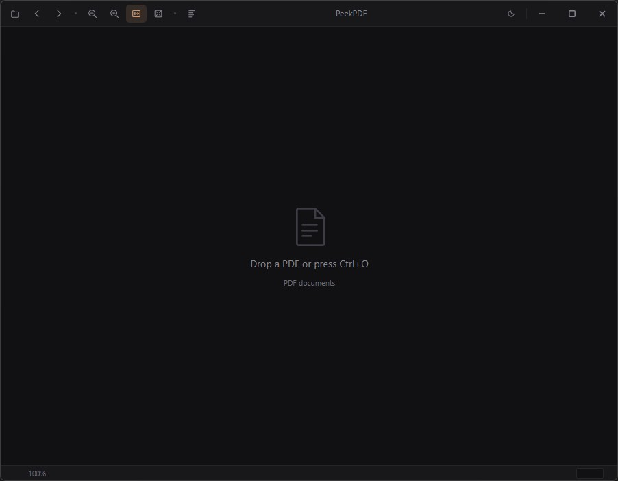

# PeekPDF

A fast, lightweight PDF viewer for Windows. Single binary, ~2 MB, starts instantly.

Built with Rust + WebView2 + pdf.js. No Electron, no framework bloat.



## Features

- **PDF rendering** — Continuous vertical scroll with page virtualization (only visible pages are rendered)
- **Zoom** — Fit-width (`W`), fit-page (`F`), free zoom with `Ctrl+scroll` / `Ctrl++` / `Ctrl+-`
- **Text selection** — Native text selection and copy via pdf.js text layer
- **Text search** — `Ctrl+F` find bar with match highlighting and next/prev navigation
- **Document outline** — `Ctrl+Shift+O` TOC sidebar from PDF bookmarks
- **Folder browsing** — Arrow keys to step through PDFs in the same directory
- **Go to page** — Type a page number in the status bar and press Enter
- **Drag & drop** — Drop a PDF onto the window to open it
- **Print** — `Ctrl+P` opens the system print dialog
- **Dark / light theme** — Catppuccin-based, toggle with the theme button
- **Window state** — Remembers position and size across sessions

## Keyboard Shortcuts

| Key | Action |
|-----|--------|
| `Ctrl+O` | Open file |
| `Ctrl+F` | Find in PDF |
| `Ctrl+Shift+O` | Toggle outline sidebar |
| `Ctrl+P` | Print |
| `←` / `→` | Previous / next PDF in folder |
| `W` | Fit width |
| `F` | Fit page |
| `Ctrl++` / `Ctrl+-` | Zoom in / out |
| `Ctrl+0` | Reset zoom to 100% |
| `Home` / `End` | First / last page |
| `Page Up` / `Page Down` | Scroll by page |

## Building

Requires Rust and the Windows SDK (for WebView2).

```
cargo build --release
```

The binary is at `target/release/peekpdf.exe`.

## Usage

```
peekpdf.exe [path-to-pdf]
```

Or just double-click the binary and use `Ctrl+O` / drag & drop.

## License

MIT
